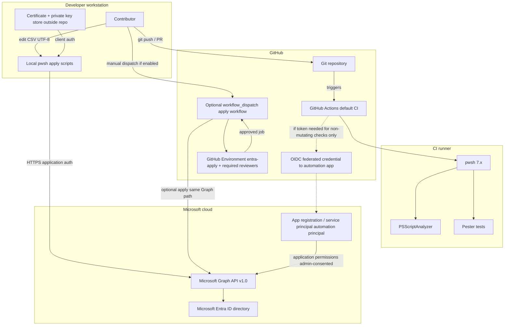

# High-Level Design: Bulk Identity Management

**Normative glossary and behavioral contract:** [CONTEXT.md](../CONTEXT.md). If this HLD conflicts with CONTEXT, CONTEXT prevails.

**Scope:** Bulk provisioning of Microsoft Entra ID member users from CSV, validate-only default CI, certificate-based local apply, optional guarded GitHub apply path, Microsoft Graph `v1.0` with least-privilege application permissions.

---

## A. The Logical Flow

1. **Developer commits and pushes**  
   A contributor changes PowerShell scripts, tests, module manifests (for example pinned `Microsoft.Graph` versions), or documentation, then pushes to the remote Git repository (for example GitHub).

2. **Default CI pipeline runs on the push or PR**  
   GitHub Actions starts a job on a hosted runner. The workflow does **not** read tenant secrets for Graph mutation and does **not** call Microsoft Graph.

3. **Optional OIDC bootstrap (validate-only context)**  
   If a future step needs Azure AD token exchange for non-mutating checks only, the workflow would use **federated workload identity (OIDC)** from GitHub Actions to the **automation principal** (app registration / service principal), with **no long-lived client secret** stored in the repository. Per **CI scope**, default pipelines remain **validate-only**; they are not required to obtain Graph tokens if all gates are local static analysis and tests.

4. **CI validation gates**  
   The runner invokes **`pwsh`** (PowerShell 7.2+, 7.4+ preferred). **PSScriptAnalyzer** runs on `.ps1` / `.psm1` and fails on **Error** and **Warning**. **Pester** runs deterministic tests (CSV contract, IT department rule, identity derivation). **Microsoft Graph is not called** in these default workflows.

5. **Operator prepares apply input**  
   An operator builds a **UTF-8** comma-separated provisioning file with a header row (**FirstName**, **LastName**, **Department**, plus optional columns). Required columns are validated before any apply; malformed input fails early.

6. **Primary apply path: local (or controlled runner)**  
   The operator runs apply scripts **locally** (or on a **self-hosted** runner they control). They authenticate the **automation principal** to Microsoft Graph using **certificate-based client credentials**: private key and certificate stay **outside** the repository; parameters reference thumbprint, cert path, **tenant ID**, and **client ID**. **Client secret** is not the default documented path.

7. **Dry run**  
   The operator runs apply in **dry run** / **`-WhatIf`** mode. The script performs read-only resolution as needed, prints a **plan** per row (create, skip, ensure group membership, and so on), and performs **no** creates, **no** password writes, and **no** group membership mutations.

8. **Mutating apply**  
   After review, the operator runs mutating apply. For each row the automation calls **Microsoft Graph `v1.0`** with **application** permissions (after admin consent): **`User.ReadWrite.All`**, **`Group.Read.All`**, **`GroupMember.ReadWrite.All`**. It creates or skips users by **UserPrincipalName**, optionally updates a documented attribute subset when **`-UpdateExisting`** is used, sets **initial passwords** for new users (random, **forceChangePasswordNextSignIn**), and **idempotently ensures** IT department rows are members of a **pre-created** security group (resolved by stable id, **Object ID** preferred). **Throttling** is handled with bounded retries, exponential backoff, and **`Retry-After`**. Row failures do not stop the batch; the process exits **non-zero** if any row failed.

9. **Optional GitHub apply path**  
   If a **separate** workflow exists, it is triggered only by **`workflow_dispatch`**, targets a **GitHub Environment** (for example **`entra-apply`**) with **required reviewers**, and is clearly labeled as tenant-mutating. Approval gates sit between repository traffic and Entra mutation.

10. **Boundary summary**  
    **Public internet** carries Git ↔ runner traffic and Graph HTTPS from the operator machine or approved runner to **Microsoft Entra / Graph**. **Tenant directory** boundaries are crossed only on **apply** with application credentials, not on every PR.

---

## B. Architecture Diagram (Mermaid.js)

---

## C. Component Mapping Matrix

| Component | Enterprise Role | Specific Function | Boundary/Zone |
|-----------|-----------------|-------------------|---------------|
| Git repository | Source of truth | Stores PowerShell automation, Pester tests, pinned module manifest, and documentation | Cloud (SaaS) |
| GitHub Actions (default CI) | CI/CD pipeline | Runs validate-only jobs on push/PR; no routine Entra mutations | CI/CD pipeline |
| GitHub-hosted runner | Build / test compute | Executes `pwsh`, PSScriptAnalyzer, and Pester | CI/CD pipeline |
| OIDC federated credential (GitHub → Entra app) | Passwordless workload identity | Allows CI to authenticate as the automation principal without a repository client secret, if needed for non-mutating scenarios aligned with CI scope | Boundary: GitHub Actions ↔ Microsoft Entra |
| PSScriptAnalyzer | Static analysis / quality gate | Enforces script quality; fails CI on Error and Warning | CI/CD pipeline |
| Pester | Automated testing | Validates CSV rules, IT matching, identity derivation without Graph | CI/CD pipeline |
| PowerShell 7 (`pwsh`) | Runtime | Required execution baseline for scripts and CI | Local; CI/CD pipeline |
| Microsoft.Graph PowerShell modules (pinned) | Dependency / API client | Invokes Graph from apply scripts using pinned versions from repository manifest | Local; optional controlled runner |
| X.509 certificate + private key (non-repo) | Credential material | Certificate-based client credentials for local (or controlled) apply | Local or secure operator-controlled store |
| App registration / service principal | Non-human identity | **Automation principal** with application permissions for bulk provisioning | Microsoft Entra |
| Microsoft Graph (`v1.0`) | Directory API | Creates/updates member users, reads groups, manages group membership, honors throttling policy | Cloud (Microsoft) |
| Microsoft Entra ID | Identity directory | Hosts users, groups, and consent for the automation app | Cloud (Microsoft) |
| Provisioning CSV (UTF-8) | Structured input | Source rows for bulk user creation and IT group rules | Local; CI validates format only |
| Optional GitHub Environment (`entra-apply`) | Governance / approval gate | Required reviewers before optional tenant-mutating workflow runs | CI/CD pipeline |
| Optional `workflow_dispatch` apply workflow | Controlled release path | Manual-only automation path to Graph apply, separated from default PR validation | CI/CD pipeline |
